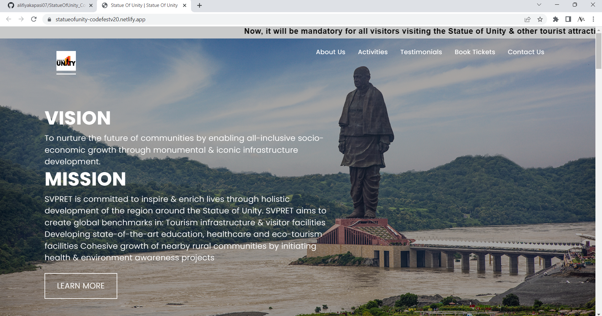
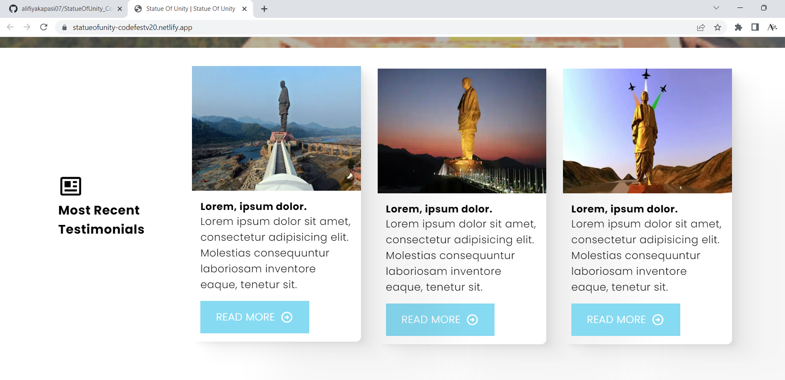
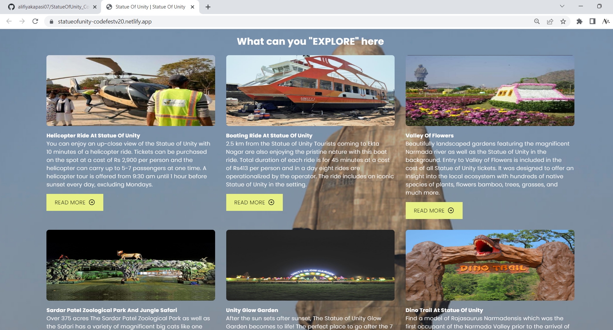

# StatueOfUnity_Codefestv2.0
> https://statueofunity-codefestv20.netlify.app/

## Website Preview
### Main Page

### Testimonials

### Places to visit near SOU

  

## Features 📋
⚡️ Fully Responsive
⚡️ Easy to modify

## Sections 📚
✔️ About Us\
✔️ Activities\
✔️ Testimonials \
✔️ Book Tickets\
✔️ Contact Us

## Tools Used 🛠️
* <b>Netlify</b> - To host my static website (HTML, CSS, JS).
